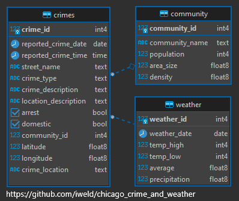

# Chicago Crime and Weather Analysis

An SQL-based exploration of how reported crime in the city of Chicago relates to average daily temperature, covering the years 2018 through 2023.

## Introduction

I wanted to dig into a question that comes up a lot in casual conversation: does crime really go up when it gets warmer outside? Rather than take that as a given, I pulled together several years of Chicago crime records and daily temperature data and used SQL to see what the numbers actually show.

The full set of questions I asked (and the answers I found) is documented in [`questions_and_answers.md`](./questions_and_answers.md).

## Datasets Used

This analysis draws on eight source CSV files, found in [`source_data/csv`](./source_data/csv):

- **chicago_areas.csv** — Reference table of Chicago neighborhoods and community areas.
- **chicago_temps_18-23.csv** — Average daily temperatures for the city, 2018–2023.
- **chicago_crime_2018.csv** — Reported crime incidents for 2018.
- **chicago_crime_2019.csv** — Reported crime incidents for 2019.
- **chicago_crime_2020.csv** — Reported crime incidents for 2020.
- **chicago_crime_2021.csv** — Reported crime incidents for 2021.
- **chicago_crime_2022.csv** — Reported crime incidents for 2022.
- **chicago_crime_2023.csv** — Reported crime incidents for 2023.

## Entity Relationship Diagram

To keep the crime, area, and temperature tables properly linked, I laid out the schema below before writing any queries:

## Tools Used

- **PostgreSQL** for storing and querying the data
- **Docker / docker-compose** to spin up a consistent local database environment
- **SQL** for all data cleaning, joining, and analysis — no external analytics libraries

## Getting Started

1. Clone this repository.
2. Run `docker-compose up` to start the PostgreSQL instance.
3. Load the CSVs from `source_data/csv` into the database.
4. Work through the queries in `questions_and_answers.md`, or write your own against the schema in the ERD above.

## What I Was Trying to Answer

At a high level, I used this dataset to dig into questions like:

- Does the volume of reported crime rise and fall with temperature across the year?
- Are certain categories of crime more temperature-sensitive than others?
- How consistent is the temperature/crime relationship year over year, from 2018 through 2023?

Full queries and results are in [`questions_and_answers.md`](./questions_and_answers.md).

---

If you use or build on this, feel free to fork it and adapt the schema or questions to your own city's data.
